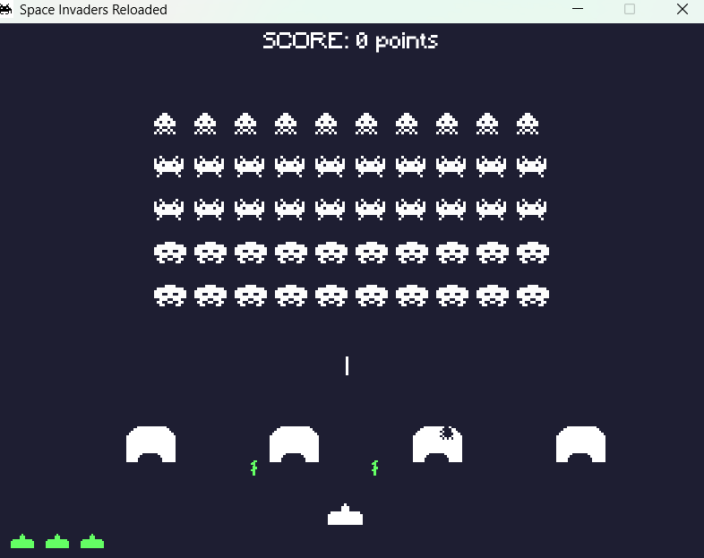

# 👾 Space Invaders C Allegro rebuild
- Arcade game remake with C language and Allegro Vivace lib. 
- Programming and Developing [PDS] 1 subject assignment, from my Computing Science Bachelor's course.

# Building Space Invaders with Allegro

This project is built using **CMake** and uses the **Allegro 5** game programming library. Below is a complete step-by-step guide for building the project from source.

## ✅ Prerequisites

Make sure the following tools are installed on your system:

### 🔧 Dependencies

* **CMake** ≥ 3.10
* **GCC** or **Clang** (for compiling)
* **Allegro 5** and required add-ons:

  * `allegro`
  * `allegro_audio`
  * `allegro_acodec`
  * `allegro_font`
  * `allegro_ttf`
  * `allegro_image`
  * `allegro_primitives`

### 🐟 On Linux (Debian/Ubuntu)

Install all dependencies with:

```bash
sudo apt update
sudo apt install cmake g++ \
    liballegro5-dev liballegro-image5-dev \
    liballegro-audio5-dev liballegro-acodec5-dev \
    liballegro-font5-dev liballegro-ttf5-dev \
    liballegro-primitives5-dev
```

### 🪟 On Windows

You can either:

* Use **MSYS2**, **vcpkg**, or **conan** to install Allegro 5.
* Or, build Allegro 5 from source.
* Then configure your compiler (e.g., MSVC or MinGW) and make sure it's accessible in your `PATH`.

### Using **vcpkg** to install Allegro5 in Windows
* Step 1: Clone vcpkg
```bash
git clone https://github.com/microsoft/vcpkg.git
cd vcpkg
.\bootstrap-vcpkg.bat
```
This compiles vcpkg.exe.

* Step 2: Add vcpkg to System PATH (optional but recommended)
Add the path to your vcpkg folder (e.g. C:\Users\you\vcpkg) to your system environment variable PATH.

* Step 3: Install Allegro5 with MinGW triplet
```powershell
vcpkg install allegro5 --triplet x64-mingw-static --host-triplet x64-mingw-static
```
---

## 📁 Cloning the Repository

First, clone the repository:

```bash
git clone https://github.com/combinedev/UFMG_space_invaders_allegro.git
cd UFMG_space_invaders_allegro
```

---

## ⚙️ Building with CMake

Create a build directory and compile the project:

```bash
mkdir build
cd build
cmake ..
make
```

If successful, an executable named `space_invaders` (or similar, depending on your `CMakeLists.txt`) will be generated.

---

## 🎮 Running the Game

After building, run the game from the `build` directory:

```bash
./space_invaders
```

> Make sure the `assets/` folder is present **in the same directory as the executable**. The game loads resources like fonts, images, and sounds from that folder.

If you're missing assets, copy them manually:

```bash
cp -r ../assets .
```

---

## 🔄 Rebuilding

To clean and rebuild the project:

```bash
rm -rf build
mkdir build
cd build
cmake ..
make
```

---

## 🥮 Testing the Build

To verify everything works:

* Confirm that no build errors occur.
* Check that the game window opens with working fonts, audio, and sprites.

---

## 🐞 Troubleshooting

**Q: Allegro header not found?**
👉 Make sure Allegro development packages are installed. On Linux, check with `dpkg -l | grep allegro`.

**Q: Missing fonts/sounds during runtime?**
👉 Check if the `assets/` folder is in the right place.

**Q: CMake can't find Allegro?**
👉 You may need to set the `CMAKE_PREFIX_PATH` if Allegro was installed in a custom directory:

```bash
cmake -DCMAKE_PREFIX_PATH=/path/to/allegro ..
```

---

## 📦 Optional: Install the Game (Linux)

You can also install the executable system-wide:

```bash
sudo make install
```

Make sure your `CMakeLists.txt` defines an `install()` rule, or let us know if you'd like help adding it.

---

## Dev logs
### >> [08/06/2025]
Studying the game's logic for basic state setup. Notes:
- Player controlled ship only moves horizontally left/right. Continuous movement until the A or D key is no longer down. (smooth moveset). Player's height is fixed on the screen bottom.
- Three types of enemies: A = 100 pts, B = 50 pts and C = 25 pts. Enemies are **30px** spaced between.
- Initial enemy matrix: 4x5, first line is only A type, second and third is only B, forth and fifth is only C.
- Monsters move all together. ->, then, when they touch the border, they switch directions, <- and lower down the entire matrix height every time nearer the ground (jump).
- A monster only shoots down if its below column is totally free or if its column is the last one.
- Player shooting has a cooldown: the last projectile must extinguish first before shooting another.
- Projectiles can extinguish by colliding with: player (death), monster (explodes and dies, leaving a spot in the matrix), another projectile, screen boundaries.

- Game end conditionals:
   * Killing all the aliens in the matrix
   * One of the aliens touches the ground
   * One of the aliens touches the player
   * Player run out of lives [3 in total]
- High score functionality:
   * Basically is a int score variable, which is visible by a text on the top and increases during the game.
   * In the end, a screen should show the player score and the highest score (initially 0, based on the file "highscore.txt").
   * If player score > highest score, highest score is updated: the number is written in the file called "highscore.txt" (overwrite)
 
 The assignment implies the deployment of a state machine:
- Menu state
- Game state
- Score state

To consider extras:
- [Optional] Occasional ufo passing above the first line of the matrix. It is deleted when is completely off the screen. Moves ->. Player projectile can explode it. Ufo = 200pts.
- Player shields, they collide with alien projectiles and are eventually completely destroyed (own hp var).
- Physics, like arrest and torque within the ship movement.

### >> [16/06/2025]
- Game is finished up.
  
- Extra mechanics added:
   * Shields
   * Player lives UI
   * State-machine (menu, game, gameover)
   * Cross-enemy projectiles
   * UFO passing probability (can you shoot'em down?)
   * Highscore.txt file register.
     
- **Controls:**
   * *[ A ]* moves the ship to the left
   * *[ D ]* moves the ship to the right
   * *[ SPACEBAR ]* shoots a projectile.
     
- **Menu navigation:**
   * *[ S ]* selects down
   * *[ W ]* selects up
   * *[ ENTER ]* loads your selection.

